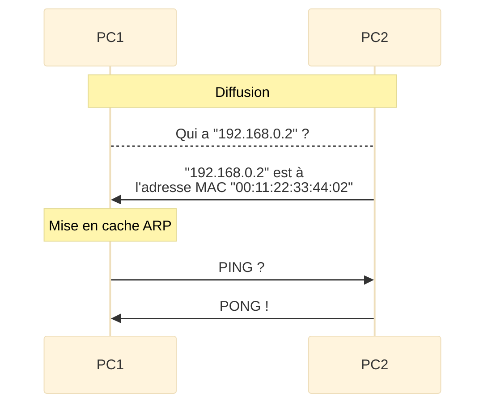

# Protocole ARP
- Protocole de Résolution d’Adresse
- Novembre 1982
- [RFC 826](https://www.rfc-editor.org/rfc/rfc826.html)

## Problématique
Les machines sur un même segment (même sous-réseau) s’envoient des paquets contenant les adresses IP source et destination, ainsi que les adresses MAC source et destination.

Une machine qui se connecte tout juste à un réseau et dispose d’une connectivité IP n’aura aucune notion de la topologie existante. Alors comment pourra t’elle communiquer avec les autres machines ?

C’est la qu’intervient le protocole ARP ou *Address Resolution Protocol*.

## Fonctionnement
Pour pouvoir envoyer un paquet à la bonne destination, une machine doit au préalable connaître l’adresse MAC de destination.

Le protocole ARP se déroule en 2 étapes, question et réponse. Prenons 2 machines:
- PC1
	- Adresse MAC: 00:11:22:33:44:**01**
	- Adresse IP: 192.168.0.**1**
- PC2
	- Adresse MAC: 00:11:22:33:44:**02**
	- Adresse IP: 192.168.0.**2**

![[Diagramme-ARP.svg]]
[Mermaid Editor](https://mermaid-js.github.io/mermaid-live-editor/edit#pako:eNptkNFKw0AQRX9lnOemJNsiOkhKaUAqtEZ9K_uyJhO7kOzW7K4gpf_iv_hjblpKBZ2nmTN3hsvdY2VrRkLH74FNxYVWb73qpIFYa-sZ7Af3UC6yUbkQBIVumuC0NSdF5EmSHzdPQYMCidmtGGfXN-N0LCTC7O61zwvt2SUtw_cXnO9Ekse7jOCBwQXtBjRolyXBrxcDWs0XBGlKWUZC0GRC0yml4h-LBCvtGNhApaotw_y5vNjMTzbL5foeZn9clI8RX-EIO-47pesYyX4QSfRb7lgixbbmRoXWS5TmEKUqePvyaSok3wceYdjVyp8TRGpU6yLdKbOx9jJzrb3tV6fYj-kffgAuYHKa)

