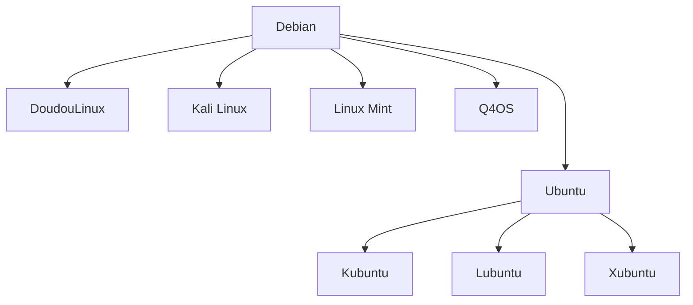

# Linux

## Le descendant de UNIX
UNIX est une famille de systèmes d'exploitation dérivé d'un système d'exploitation du même nom créé par l'opérateur téléphonique américain AT&T dans les années 1970.

UNIX était développé par les fabricants de matériel pour leur matériel, il y avait Unix pour HP, Unix pour Solaris, Unix pour … C'est pourquoi en 1991, un étudiant finlandais du nom de Linus TORVALDS s'inspire de Unix pour écrire un noyau de système d'exploitation qui tournerait sur les architectures de processeur x86: Freax. Linus a fait héberger le noyau par un de ses amis qui l'a appelé Linux, c'était trop tard.

## Un noyau
(**L**inux **I**s **N**ot **U**ni**X**) est un noyau (mini programme) qui charge d'autres programmes, eux même chargent d'autres programmes. Le projet GNU (initialement pour Unix par Richard STALLMAN) contient des logiciels majoritairement (tous?) libres, développés et compilés en C, les rendant également compatibles avec le noyau Linux.

La première distribution née de l'association du noyau de TORVALDS et du projet de STALLMAN a vu le jour le 15 septembre 1993 au nom de « Debian » et se dit un système d'exploitation « GNU/Linux » pour créditer les deux projets.

## Exemple avec Debian

![[linux-descendants-diagram.svg|500]]

